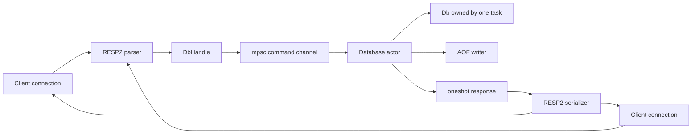

# Sparky

```text
 ____  ____   _    ____  _  __ __   __
/ ___||  _ \ / \  |  _ \| |/ / \ \ / /
\___ \| |_) / _ \ | |_) | ' /   \ V /
 ___) |  __/ ___ \|  _ <| . \    | |
|____/|_| /_/   \_\_| \_\_|\_\   |_|
```

Sparky is a Redis-like in-memory data store written from scratch in Rust. It speaks RESP2 over TCP, works with standard `redis-cli`, supports strings, lists, hashes, and sets, and persists successful write commands through an append-only file (AOF).

The project is intentionally focused on the core systems problems behind a small Redis implementation:

- incremental RESP2 parsing over a TCP stream;
- concurrent client connections with serialized command execution;
- type-safe operations across multiple in-memory data structures;
- lazy and active key expiration;
- crash recovery through AOF replay; and
- a refactor from shared locking to an actor-owned database.

## Current status

The core MVP is complete. The server currently implements:

- RESP2 simple strings, errors, integers, bulk strings, arrays, and nil values;
- one logical database;
- concurrent TCP client connections;
- actor-based command execution;
- AOF persistence and replay;
- configurable AOF synchronization policy; and
- integration coverage for command behavior and restart recovery.

This is not intended to be a drop-in replacement for every Redis feature. Cluster mode, RESP3, sorted sets, blocking list commands, RDB snapshots, replication, and scripting are intentionally outside the current scope.

## Requirements

- Rust stable with Cargo
- Redis tools for the examples and benchmark script:
  - `redis-cli`
  - `redis-server`
  - `redis-benchmark`

The server itself does not require a Redis installation; Redis tools are only needed for convenient client testing and comparisons.

## Build and run

Build and start Sparky with the default configuration:

```bash
cargo run
```

The default server address is:

```text
127.0.0.1:6969
```

The default AOF file is `sparky.aof` in the working directory. The server prints a startup banner and reports the address it is listening on.

### Environment variables

| Variable | Default | Description |
|---|---:|---|
| `SPARKY_PORT` | `6969` | TCP port used by the server |
| `SPARKY_AOF` | `sparky.aof` | AOF file path |
| `SPARKY_AOF_FSYNC` | `everysec` | AOF policy: `always`, `everysec`, or `no` |

Example:

```bash
SPARKY_PORT=6970 \
SPARKY_AOF=/tmp/sparky.aof \
SPARKY_AOF_FSYNC=everysec \
cargo run --release
```

The server binds to localhost only. It does not provide authentication or TLS, so it should not be exposed directly to an untrusted network.

## Using redis-cli

Start Sparky in one terminal, then connect from another:

```bash
redis-cli -p 6969
```

Example session:

```text
127.0.0.1:6969> SET user:1 alice
OK
127.0.0.1:6969> GET user:1
"alice"
127.0.0.1:6969> RPUSH colors red blue green
(integer) 3
127.0.0.1:6969> LRANGE colors 0 -1
1) "red"
2) "blue"
3) "green"
127.0.0.1:6969> HSET user:1 name alice role admin
(integer) 2
127.0.0.1:6969> SADD languages rust go
(integer) 2
```

## Supported commands

### Connection and server commands

```text
PING ECHO INFO DBSIZE FLUSHALL FLUSHDB
```

### Strings

```text
SET GET MGET MSET
INCR DECR INCRBY APPEND STRLEN
GETSET GETDEL
```

`SET` supports the following options after the key and value:

```text
EX seconds
PX milliseconds
NX
XX
GET
```

Examples:

```text
SET cache:value 42 EX 60
SET cache:value 43 XX
SET new:key value NX
SET counter 2 GET
```

`NX` and `XX` are mutually exclusive. A failed conditional write returns nil, and `GET` returns the previous value when applicable.

### Generic key commands

```text
DEL EXISTS TYPE KEYS
EXPIRE PEXPIRE TTL PTTL PERSIST
RENAME
```

`KEYS` currently supports the patterns `*` and `prefix*`.

```text
KEYS *
KEYS user:*
```

`RENAME` works across strings, lists, hashes, and sets. It replaces an existing destination key and preserves the source key's TTL.

### Lists

```text
LPUSH RPUSH LRANGE LLEN
LPOP RPOP LINDEX LSET LREM
```

Negative indexes are supported by `LRANGE`, including the common form:

```text
LRANGE mylist 0 -1
LRANGE mylist -3 -1
```

For `LPOP key` and `RPOP key` without a count, an empty or missing list returns nil. Count forms return an array.

### Hashes

```text
HSET HGET HDEL HEXISTS HGETALL HKEYS HVALS HLEN HINCRBY
```

`HINCRBY` rejects non-integer fields with a Redis-style error rather than silently replacing the value.

### Sets

```text
SADD SREM SMEMBERS SISMEMBER SCARD
SINTER SUNION SDIFF
```

Keys have one logical type at a time. Applying a data-structure command to a key owned by another type returns `WRONGTYPE`.

## Expiration

Sparky uses a hybrid expiration strategy:

1. Accessing a key lazily removes it if its deadline has passed.
2. The database actor periodically sweeps expired keys in the background.

TTL responses follow Redis semantics:

```text
-2  key does not exist
-1  key exists but has no expiration
>=0 remaining time
```

Examples:

```text
SET session abc EX 30
TTL session
PTTL session
PERSIST session
```

Overwriting a key without an expiry removes its previous TTL. Renaming a key carries its TTL to the new name.

## Persistence

Sparky uses an append-only file. Successful mutating commands are serialized as RESP2 frames and appended to the AOF. On startup, the file is parsed and replayed into a fresh database before the TCP listener accepts clients.

The actor performs command execution and AOF append in order, so a successful write is recorded after it has been applied. Failed commands are not added to the AOF. The AOF writer reuses a serialization buffer and only flushes/synchronizes according to the configured policy rather than flushing on every command.

### AOF synchronization policies

```bash
# Safest, slowest: synchronize every write.
SPARKY_AOF_FSYNC=always cargo run --release

# Recommended default: synchronize at most once per second.
SPARKY_AOF_FSYNC=everysec cargo run --release

# Fastest, but relies on the operating system to flush data.
SPARKY_AOF_FSYNC=no cargo run --release
```

The policy is a durability/performance tradeoff. `everysec` can lose approximately one second of the most recent writes if the process and operating system fail before the next synchronization.

## Architecture



### Request path

Each connection task reads bytes from its TCP socket and keeps incomplete frames in a `BytesMut` buffer. Complete RESP2 messages are parsed and sent to the database actor through an `mpsc` channel. The actor executes commands in order, drains commands already waiting in the queue as a batch, optionally appends successful writes to the AOF, and sends each response back through its `oneshot` channel.

This gives the server concurrent network I/O while preserving Redis-style atomic command execution without placing a `Mutex<Db>` in every connection task.

### Database model

`Db` owns separate maps for:

```text
strings      HashMap<Bytes, Bytes>
lists        HashMap<Bytes, VecDeque<Bytes>>
hashes       HashMap<Bytes, HashMap<String, Bytes>>
sets         HashMap<Bytes, HashSet<Bytes>>
expirations  HashMap<Bytes, Instant>
```

Top-level Redis keys use `bytes::Bytes`, allowing parsed RESP key buffers to be reused through cheap reference-counted clones instead of converting every key to an allocated `String`. Hash field names remain `String` in the current implementation. Commands validate the target key's current type before mutation. Generic operations such as `DEL`, `EXISTS`, `TYPE`, `KEYS`, and `RENAME` operate across all typed maps.

## Mutex-to-actor design decision

The initial design used a shared database protected by a global mutex. It was simple and correct, but every connection contended for the same lock. It also made persistence ordering harder to reason about because command execution and AOF append were separate operations.

The current design uses one actor task that owns `Db` and receives commands through message passing. This provides:

- one clear serialization point for mutations;
- deterministic command ordering;
- AOF append ordering tied directly to command execution;
- no database lock held by connection tasks; and
- concurrent client reads and writes at the networking layer.

The hot path also avoids cloning complete list values for `LRANGE`, reuses the AOF encoder buffer, batches commands already queued for the actor, and avoids repeated top-level key allocations.

The tradeoff is that all commands still pass through one execution queue, matching Redis's single-threaded command semantics. Slow disk synchronization can still delay later commands when using `SPARKY_AOF_FSYNC=always`.

## Testing

Run formatting, unit/integration tests, and Clippy:

```bash
cargo fmt --check
cargo test
cargo clippy --all-targets --all-features -- -D warnings
```

The integration test starts the actual Sparky binary over TCP and verifies:

- RESP command handling;
- strings, lists, hashes, and sets;
- `DEL` across all data types;
- `RENAME` across all data types;
- TTL preservation through rename;
- AOF replay after restart; and
- `FLUSHDB` persistence through restart.

The test can be run independently with:

```bash
cargo test --test integration_commands
```

The shell scripts and integration tests bind localhost ports and may require network permissions in restricted environments.

## Benchmarking

The repository includes `benchmark.sh`, which starts Sparky and a separate Redis instance, runs identical string, list, hash, and set workloads, and saves CSV throughput and latency results in `benchmark_results/`.

```bash
./benchmark.sh
```

Custom request and client counts:

```bash
./benchmark.sh 100000 50
```

Custom ports and AOF policies:

```bash
SPARKY_PORT=6970 \
REDIS_PORT=6380 \
SPARKY_AOF_FSYNC=everysec \
REDIS_AOF_FSYNC=everysec \
./benchmark.sh 100000 50
```

The saved benchmark run in `benchmark_results/` produced the following throughput results:

| Command | Sparky | Redis | Relative result |
|---|---:|---:|---:|
| `SET` | 111,732 req/s | 152,905 req/s | Sparky ~1.37× slower |
| `GET` | 114,025 req/s | 163,666 req/s | Sparky ~1.44× slower |
| `LPUSH` | 112,613 req/s | 163,399 req/s | Sparky ~1.45× slower |
| `RPUSH` | 112,740 req/s | 166,389 req/s | Sparky ~1.48× slower |
| `LPOP` | 113,507 req/s | 167,785 req/s | Sparky ~1.48× slower |
| `RPOP` | 111,607 req/s | 168,919 req/s | Sparky ~1.51× slower |
| `SADD` | 113,122 req/s | 167,785 req/s | Sparky ~1.48× slower |
| `HSET` | 111,235 req/s | 165,837 req/s | Sparky ~1.49× slower |
| `LRANGE_100` | 62,854 req/s | 86,207 req/s | Sparky ~1.37× slower |

The benchmark used the same workload and AOF policy for both servers. `LRANGE_100` reads the first 100 elements after the benchmark setup has populated a longer list. These numbers are machine- and configuration-dependent; they are included as a reproducible result rather than a universal performance claim. Re-run the benchmark after substantial performance changes before treating the table as a current measurement. The raw data is available in [`benchmark_results/`](benchmark_results/).

## Project layout

```text
src/
├── main.rs                 server bootstrap and environment configuration
├── server.rs               TCP accept loop
├── connection.rs           per-client RESP read/write loop
├── resp/
│   ├── parser.rs           incremental RESP2 parser
│   └── serializer.rs       RESP2 response serializer
├── commands/               command dispatch and command implementations
├── db/
│   ├── mod.rs              in-memory data model and key lifecycle
│   └── actor.rs            command channel and database actor
└── persistence/
    └── aof.rs              AOF writer, fsync policy, and replay

tests/
└── integration_commands.rs end-to-end TCP and restart tests

benchmark.sh                Sparky-versus-Redis benchmark harness
```

## Deliberate limitations

The current MVP intentionally does not implement:

- multiple logical databases and `SELECT`;
- sorted sets;
- blocking list commands;
- RDB snapshots;
- replication;
- RESP3; or
- Lua scripting and Redis modules.

These are possible future extensions, but they are not required for the current single-node RESP2 MVP.

## License

Sparky is released under the [MIT License](LICENSE).
